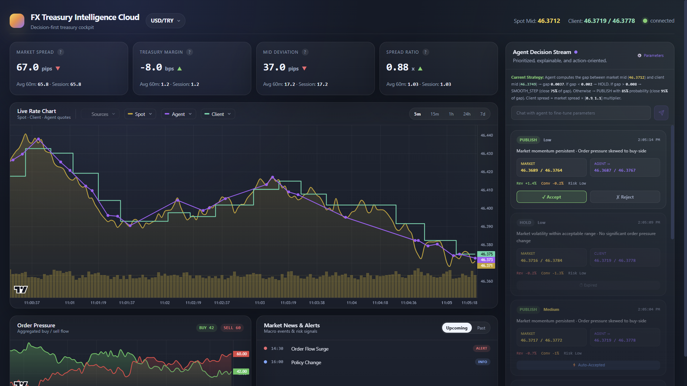

# FX Treasury Intelligence Cloud

A real-time FX pricing **decision cockpit**. An AI agent continuously proposes executable FX
rate updates on a fixed cycle, visualized on a live market control chart and governed through
**human-in-the-loop** approval. This is not a passive dashboard — it is a live pricing policy
engine where the system decides and the human approves or overrides.



## Features

- **Agent Decision Stream** — the agent emits `HOLD` / `PUBLISH` / `SMOOTH_STEP` decisions with
  confidence, reasoning, and expected impact (revenue, conversion, execution risk).
- **Human-in-the-loop control** — every decision can be **Accepted** or **Rejected**; accepted
  decisions become active client-rate policy immediately. Pending decisions auto-accept after a
  configurable window.
- **Live rate chart** — spot, agent-suggested, and client-published quotes on a single time axis,
  with blinking agent suggestion markers and smooth-step transition paths.
- **KPI cards** — market spread, treasury margin, mid deviation, and spread ratio with rolling
  and session averages.
- **Order pressure** — aggregated buy/sell flow visualization.
- **Market news & alerts** — timestamp-aligned macro events and risk signals.
- **Conversational tuning** — chat with the agent in plain language to fine-tune pricing
  parameters (spread multipliers, hold thresholds, publish probability, smoothing, auto-accept).
- **Multi-pair** — USD/TRY and EUR/TRY, with selectable time ranges (5m / 15m / 1h / 24h / 7d).

## Tech stack

| Layer     | Stack                                                        |
| --------- | ------------------------------------------------------------ |
| Frontend  | React 18, Vite, Tailwind CSS, Lightweight Charts             |
| Backend   | Node.js, Express                                             |
| Structure | npm monorepo (`backend/` + `frontend/`)                      |

## Project structure

```
fx-treasury/
├── backend/
│   └── src/
│       ├── server.js          # Express API
│       ├── rateEngine.js      # Market/client rate generation
│       ├── decisionEngine.js  # HOLD / PUBLISH / SMOOTH_STEP logic + agent params
│       ├── orderBookEngine.js # Order pressure / order book
│       └── tickStore.js       # Historical tick storage
├── frontend/
│   └── src/
│       ├── App.jsx
│       ├── components/        # Chart, DecisionFeed, KpiCards, AgentChat, ...
│       └── services/api.js    # API client
└── package.json               # Monorepo scripts
```

## Getting started

### Prerequisites

- Node.js 18+ (backend uses `node --watch`)

### Install

```bash
npm run install:all
```

### Run (backend + frontend together)

```bash
npm run dev
```

- Frontend: http://localhost:5173
- Backend API: http://localhost:3001 (proxied under `/api` from the frontend)

Or run each side individually:

```bash
npm run dev:backend
npm run dev:frontend
```

## API reference

| Method | Endpoint                       | Description                                  |
| ------ | ------------------------------ | -------------------------------------------- |
| GET    | `/api/rates?pair=`             | Latest market + client quote                 |
| GET    | `/api/rates/history?pair=&range=` | Historical ticks (`5m`,`15m`,`1h`,`24h`,`7d`) |
| GET    | `/api/decision?pair=`          | Latest agent decision                        |
| GET    | `/api/decisions/history?pair=` | Decision history                             |
| POST   | `/api/decision/:id/accept`     | Accept a decision (activates client rate)    |
| POST   | `/api/decision/:id/reject`     | Reject a decision                            |
| GET    | `/api/orderbook?pair=`         | Order pressure / order book                  |
| GET    | `/api/agent/params`            | Current agent parameters                     |
| PUT    | `/api/agent/params`            | Update agent parameters                      |

Supported pairs: `USDTRY`, `EURTRY`.

## Decision logic

Each cycle the agent computes the gap between market mid and client mid:

- **gap < `holdThreshold`** → `HOLD` (leave client rate unchanged)
- **gap > `smoothStepThreshold`** → `SMOOTH_STEP` (converge gradually, closing part of the gap)
- **otherwise** → `PUBLISH` with `publishProbability` (close most of the gap)

Client spread is derived from the market spread scaled by a configurable multiplier range. All
thresholds, factors, and the auto-accept window are tunable via the agent parameters panel or the
in-app chat.
